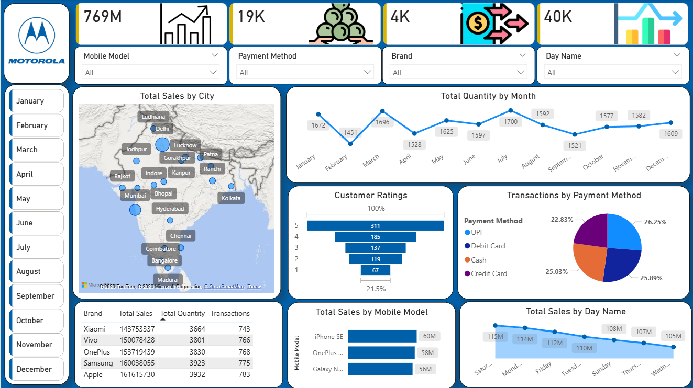

# 📊 Mobile Sales Dashboard – Power BI Project

## 📌 Project Overview
This project is an interactive **Mobile Sales Dashboard built using Microsoft Power BI**.  
It analyzes mobile phone sales data to provide insights into **sales performance, brand performance, and regional sales trends**.  
The dashboard helps businesses and analysts make **data-driven decisions** by visualizing important sales metrics.

---

## 📁 Project Structure

- **Dashboard.png** – Preview image of the dashboard  
- **Mobile Sales Data.xlsx** – Dataset used for analysis  
- **PowerBI Project 01 - Mobile Sales Dashboard.pbix** – Power BI dashboard file  

---

## 📊 Dashboard Features
- **Sales Overview**
  - Total Sales
  - Total Quantity Sold
  - Total Transactions
  - Average Sales Value

- **Brand Analysis**
  - Sales by mobile brand
  - Comparison of top performing brands

- **Time Analysis**
  - Monthly sales trends
  - Sales growth insights

- **Regional Analysis**
  - Sales by city or region
  - Geographic visualization using maps

---

## 🛠 Tools & Technologies
- **Microsoft Power BI** – Dashboard creation  
- **Power Query** – Data cleaning and transformation  
- **DAX (Data Analysis Expressions)** – KPI calculations  
- **Microsoft Excel** – Dataset storage  

---

## 📷 Dashboard Preview

---

## 🚀 How to Use
1. Download or clone this repository.
2. Open **PowerBI Project 01 - Mobile Sales Dashboard.pbix** using **Microsoft Power BI Desktop**.
3. If required, refresh the dataset from **Mobile Sales Data.xlsx**.
4. Explore the interactive dashboard and visuals.

---

## 📊 Skills Demonstrated
- Data Visualization  
- Dashboard Design  
- Data Cleaning  
- KPI Analysis  
- Business Intelligence Reporting  
- Power BI Development  

---

## 👨‍💻 Author
**Rohit Gadai**  
B.Tech Computer Engineering  
Aspiring Data Analyst and DevOps Engineer
